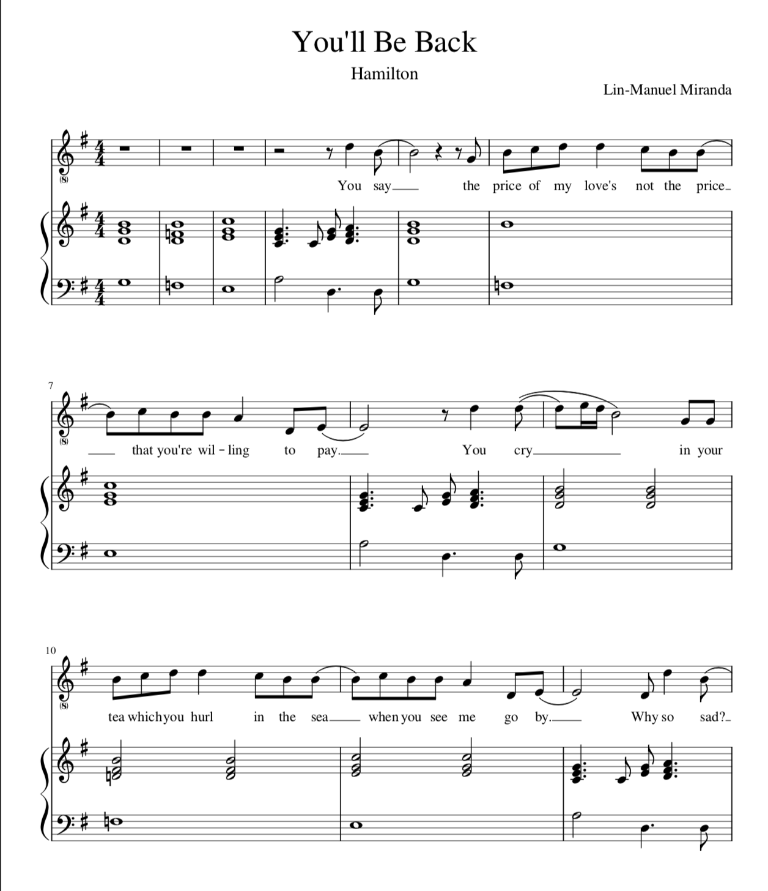
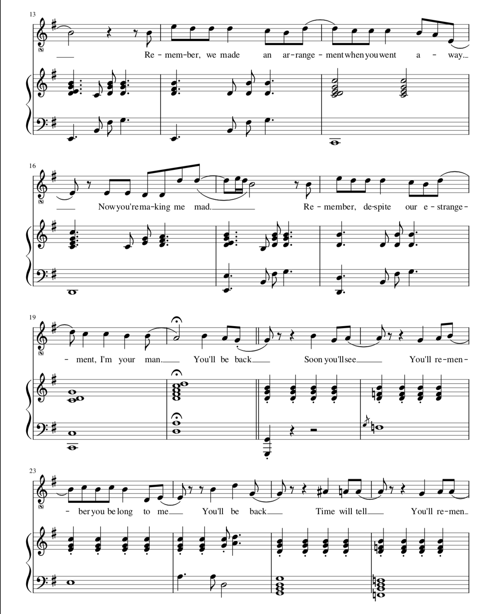
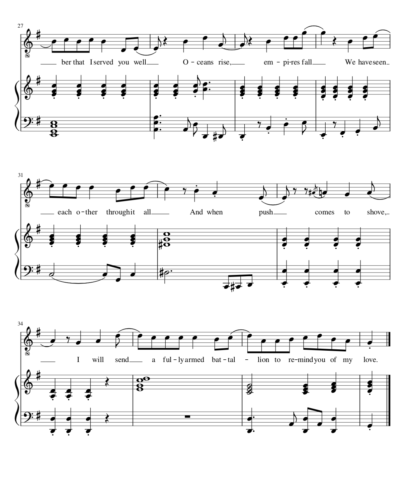

# MCA

| Week 1 | Week 2 | Week 3 | Week 4 | Week 5 |
| ---|---|---|---|---|
| [Music Data](README.md) | [Notated Data](week2.md) | [Encoded Notation](week3.md) | Computational Analytics | Standards in Curation |

# Week 2: Notated Data 

This week, I transcribed the song *You'll Be Back* to [MuseScore file](You'll_Be_Back.mscz). Besides the notations, I also added lyrics when transcribing. The song is the 7th song of Act One of the musical Hamilton and is written by Lin-Manuel Miranda. 
The music sheet can be found on [SheetMusicFree](https://sheetmusic-free.com/youll-be-back-sheet-music-hamilton/). 
The screenshots of my MuseScore file are shown below. 

